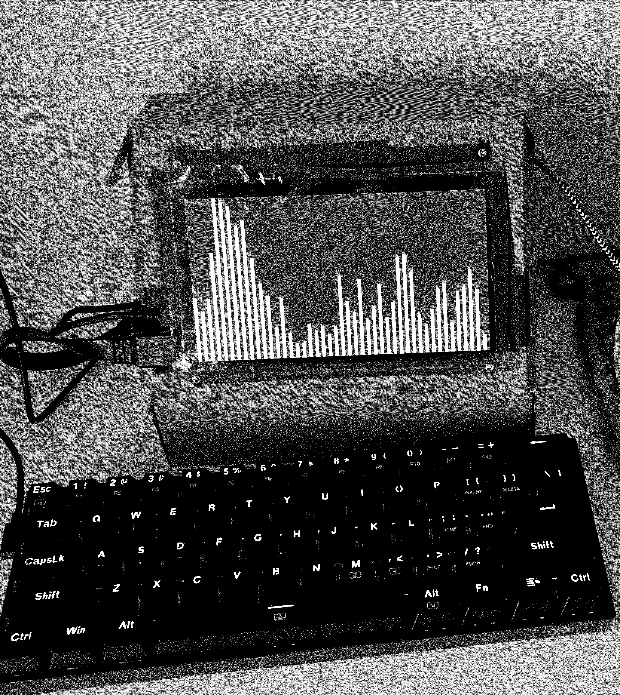

# 5kradio self-hosted streaming server

## welcome 

this is an open source audio streamer designed by phoebe from the 5k radio team.

it comes pre-packaged with mpd, ncmpcpp & icecast (plus some other goodies)

## How to access 5kradio's self-hosted stream. 

When the server is online you can access it through it's stream url: https://5kradiostream.ddns.net:8443/stream.ogg or any compatible client.`

## Streaming audio form a raspberry pi. 

Using [icecast2](http://icecast.org/), [MPD](https://www.musicpd.org/) and [ncmpcpp](https://github.com/ncmpcpp/ncmpcpp).

## Useful ressources: 
[MPD documentation](https://mpd.readthedocs.io/en/latest/)
[MPD man page](https://manpages.org/mpd)
[ncmpcpp man page](https://manpages.org/ncmpcpp)
[Ubuntu fr Icecast2 docs](https://doc.ubuntu-fr.org/icecast2)

### Dedicated are.na channel: 
[internet_audio](https://www.are.na/phoebe-lartisant-nnvxfta5prg/internet_audio)

#### Others in config
- [tmux](https://github.com/ohmyzsh/ohmyzsh/blob/master/plugins/tmux/tmux.plugin.zsh) omz plugin 
- [ZSH](https://www.zsh.org/)
- [oh-my-zsh](https://github.com/ohmyzsh)

#### What it looks like 

